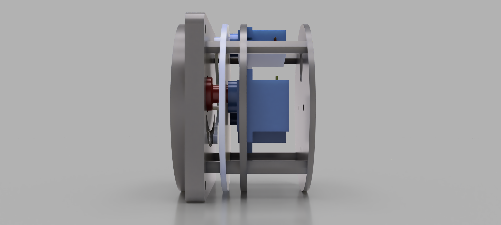

## Cessna 152 Turn Coordinator

Assembly video: https://www.youtube.com/watch?v=H4nPsCZAo3s

### Parts used (affiliate links):
* SG90 Micro Servo: https://amzn.to/3rXwhOL
* Plastic nylon screws and nuts: https://amzn.to/450jeuw
* SUNLU 3D Printer Rapid Resin: https://amzn.to/3rSg39O
* Edding 751 Paint Marker Pen: https://amzn.to/3DE3AZO
* Pack of 16 Clear Acrylic Plates: https://amzn.to/45bq3td
* Isopropanol 99.9%: https://amzn.to/3Kl7OcP
* Nitril gloves: https://amzn.to/3DViIm1
* Sovol Solar Turntable: https://amzn.to/3OdZVa1
* Red Plastidip: https://amzn.to/3QnU7gT
* JOREST Resin Funnel Stainless Steel with Strainer + Cleaning Brush + Scrub Pad: https://amzn.to/3Yi1vfV
* DUPLI-COLOR Aqua Eco+ Clear Varnish: https://amzn.to/456sjBY
* ELEGOO Mars 3 Pro, Resin 3D Printer: https://amzn.to/3rSXsKR
* Grundig UC 5020 Ultrasound cleaner: https://amzn.to/3Yfpex0